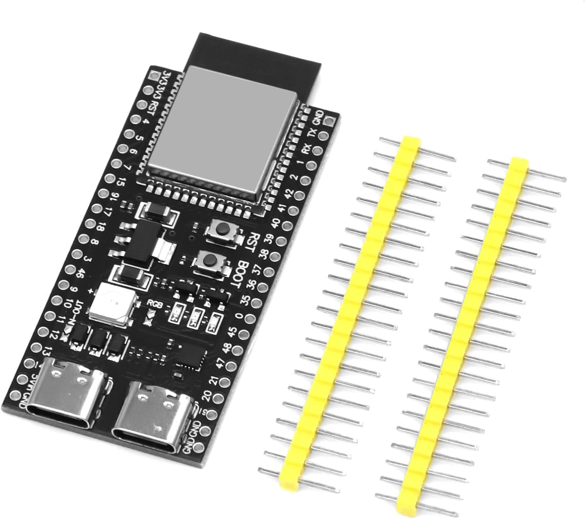
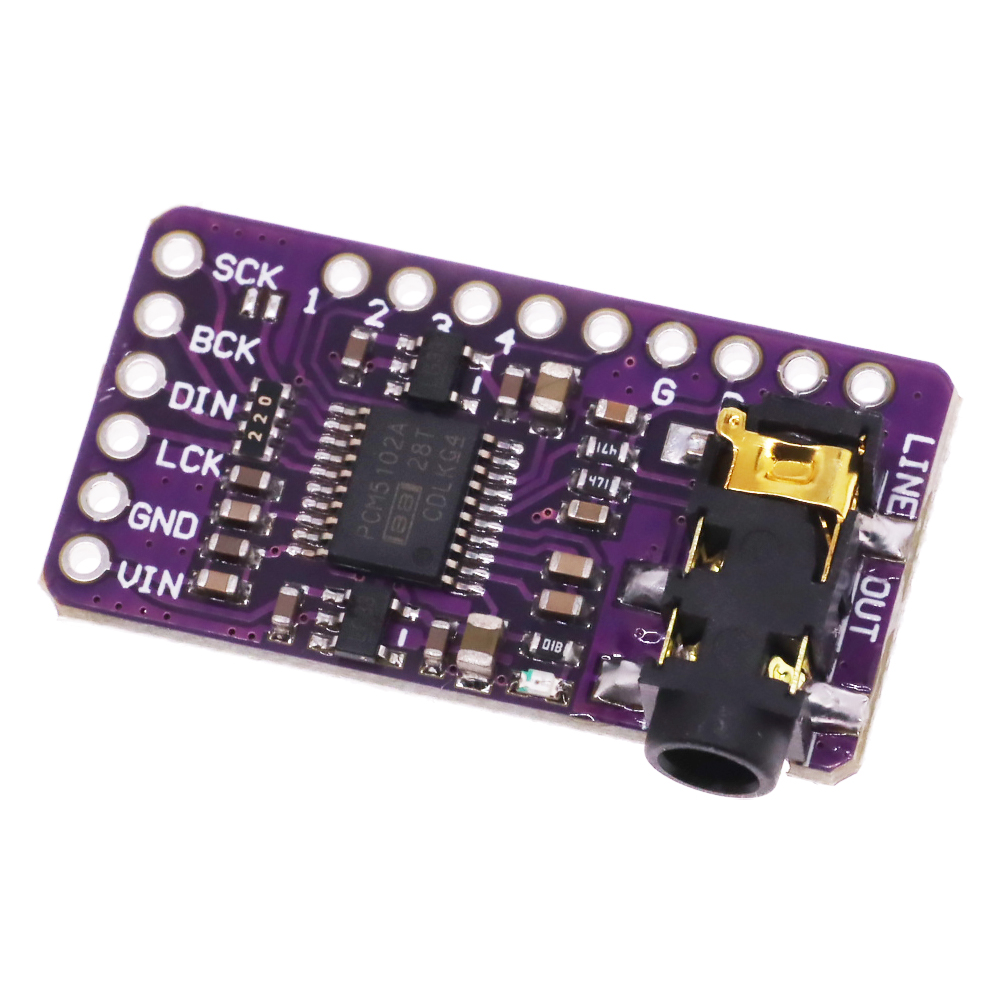
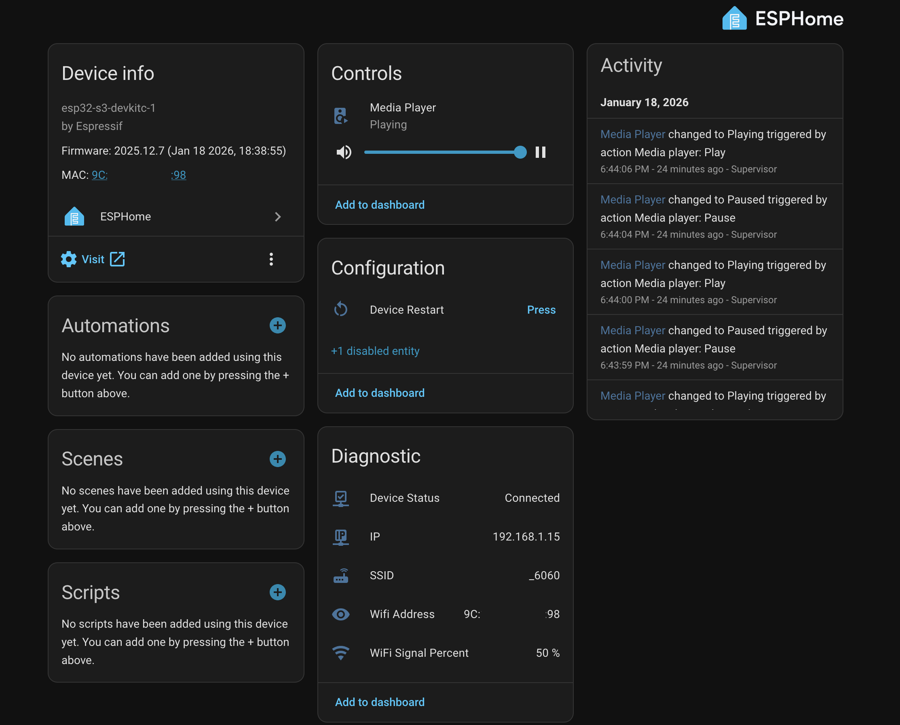

# 🎵 ESP32-S3 WiFi Media Player for Home Assistant (ESPHome)

This project is a high-quality WiFi network media player based on ESP32-S3 and ESPHome, designed to integrate with Home Assistant. 

Based on this https://www.youtube.com/watch?v=AhRVRsdLZBc and improved with mixer and announcement

It supports:

- ✅ High quality I2S audio output (PCM5102 DAC)
- ✅ Media playback from Home Assistant
- ✅ Announcement mixing with ducking
- ✅ Web interface
- ✅ OTA updates
- ✅ Stereo 48kHz output
- ✅ PSRAM optimized for audio buffering
- ✅ Mixer + resampler pipelines
- ✅ FLAC announcements (low CPU usage)

### Wiring
```
        +-------------------+              +-------------------+
        |     ESP32-S3      |              |     PCM5102       |
        |                   |              |                   |
        | GPIO21 (LRCLK) ---+------------> | LRCK              |
        | GPIO5  (BCLK) ----+------------> | BCK               |
        | GPIO19 (DATA) ----+------------> | DIN               |
        | GND --------------+------------> | GND               |
        | 5V / 3V3 ---------+------------> | VCC               |
        +-------------------+              +-------------------+
```
> ⚠️ Power: Most PCM5102 boards work with 5V or 3.3V — check your module!

### 🧱 Hardware Used

| Component | Image |
|----------|--------|
| ESP32-S3 |  |
| PCM5102 |  |

#### 🛠️ ESPHome Configuration

Main features of the config:

- ESP-IDF framework
- PSRAM enabled and optimized
- I2S audio output
- Mixer speaker with two channels:
  - Media
  - Announcements
  - Resamplers to 48kHz
  - Media player component with ducking automation
 
## 🏠 Home Assistant Integration



The device appears in Home Assistant as:

- 📻 Media Player entity
- 📶 WiFi signal sensor
- 🌐 IP address sensor
- 🔁 Restart button
- ❤️ Online status sensor

You can:
- Play media
- Send TTS
- Send announcements
- Use it in automations  
